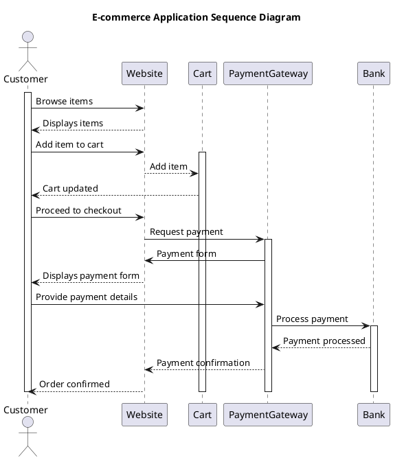

# Purchase Flow Diagram

```plantuml
@startuml
title E-commerce Application Sequence Diagram

actor Customer
participant Website
participant Cart
participant PaymentGateway

activate Customer
Customer -> Website: Browse items
Website --> Customer: Displays items
Customer -> Website: Add item to cart
activate Cart
Website --> Cart: Add item
Cart --> Customer: Cart updated
Customer -> Website: Proceed to checkout
Website -> PaymentGateway: Request payment
activate PaymentGateway
PaymentGateway -> Website: Payment form
Website --> Customer: Displays payment form
Customer -> PaymentGateway: Provide payment details
PaymentGateway -> Bank: Process payment
activate Bank
Bank --> PaymentGateway: Payment processed
PaymentGateway --> Website: Payment confirmation
Website --> Customer: Order confirmed
deactivate Bank
deactivate PaymentGateway
deactivate Cart
deactivate Customer
@enduml
```
